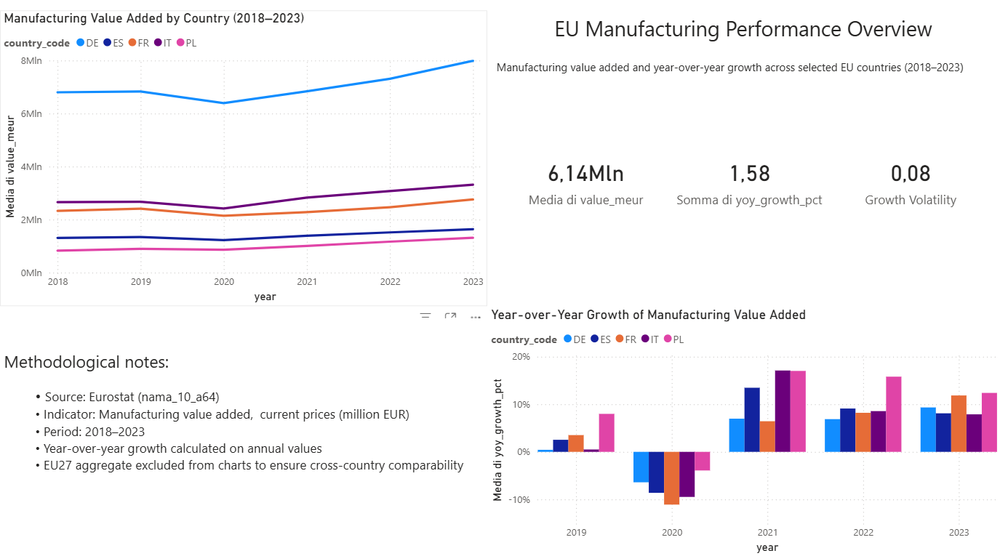

# EU Industrial KPI Analysis

## Project Overview
This project analyzes manufacturing performance across selected European Union countries using industrial value-added indicators.
The objective is to provide a clear, business-oriented overview of structural trends, growth dynamics, and relative performance differences within the EU manufacturing sector.

The analysis focuses on cross-country comparability over time, highlighting how manufacturing value added and year-over-year growth evolved between 2018 and 2023.
The project is designed to support strategic interpretation of industrial performance rather than descriptive reporting, with a focus on decision-relevant KPIs and visual synthesis.

## Business Objective
The business objective of this project is to assess and compare manufacturing performance across selected EU countries using value-added–based KPIs.
The analysis aims to support strategic evaluation of industrial strength, growth resilience, and performance differentiation within the European manufacturing sector.

By focusing on comparable indicators over time, the project enables decision makers to identify relative leaders, laggards, and structural trends that may inform industrial strategy, investment considerations, and policy-oriented discussions.

## Data Sources
The analysis is based on official European statistical data sourced from Eurostat.

- Dataset: Manufacturing value added (nama_10_a64)
- Indicator: Manufacturing value added at current prices (million EUR)
- Geographic scope: Selected EU countries
- Time period: 2018–2023

The use of harmonized Eurostat data ensures cross-country comparability and methodological consistency across the entire analysis period.

## Key KPIs & Metrics
The analysis focuses on a set of core industrial performance KPIs designed to capture both structural size and dynamic behavior of the manufacturing sector.

- Manufacturing Value Added  
  Average manufacturing value added expressed in million EUR, used as a proxy for industrial scale and economic contribution.

- Year-over-Year Growth Rate  
  Annual percentage change in manufacturing value added, capturing short-term growth dynamics and recovery patterns.

- Growth Volatility  
  Variability of year-over-year growth rates over the analysis period, used to assess stability and resilience of manufacturing performance.

## Methodology
The project follows a structured analytical workflow designed to ensure data consistency, comparability, and interpretability of results.

Raw Eurostat data were extracted and organized into a clean, analysis-ready structure. The dataset was then filtered to selected

## Dashboard Preview

Interactive dashboard summarizing manufacturing performance and growth dynamics across selected EU countries.

## Key Insights
- Manufacturing value added shows a clear divergence across selected EU countries, highlighting persistent structural differences in industrial scale and economic contribution.

- The 2020 contraction is visible across all countries, followed by heterogeneous recovery patterns, with some economies exhibiting stronger post-2021 growth momentum than others.

- Growth volatility varies significantly across countries, suggesting differences in industrial resilience and exposure to cyclical fluctuations within the EU manufacturing sector.

## Limitations & Next Steps
The analysis is based on aggregated manufacturing value added data and does not account for firm-level heterogeneity or sectoral sub-industries within manufacturing.
As a result, the insights are intended to support high-level strategic interpretation rather than granular operational analysis.

Future extensions could include the integration of additional industrial indicators, normalization by employment or population, and deeper sectoral breakdowns to enhance analytical depth and decision relevance.
